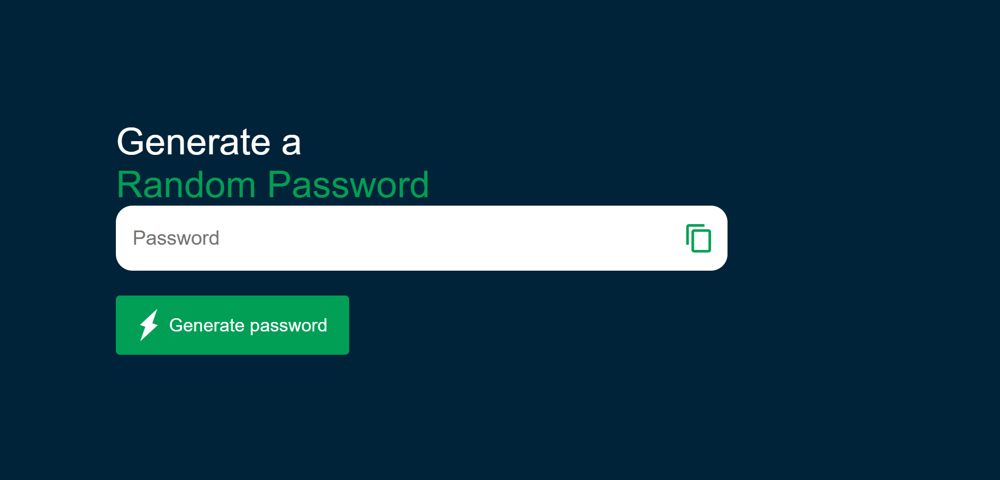

# Passwordgenerator
# 🔐 Random Password Generator

A simple yet powerful Random Password Generator built using JavaScript (or Python/C++ depending on your implementation) that creates strong and secure passwords to help users enhance their online security.

## 🚀 Features

- Generate completely random passwords
- Choose password length
- Include/exclude:
  - Uppercase letters
  - Lowercase letters
  - Numbers
  - Special characters
- One-click copy to clipboard (if applicable)
- Lightweight and fast

## 📸 Demo

 <!-- Replace with your actual image if you have one -->

## 🛠️ Technologies Used

- **Frontend**: HTML, CSS, JavaScript  
<!-- Or update based on your tech stack -->
- **Logic**: JavaScript functions (can be adapted for Python/C++)

## 🧪 How It Works

1. User selects desired options:
   - Password length
   - Character types (uppercase, lowercase, digits, symbols)
2. The script uses `Math.random()` (or a secure RNG) to randomly pick characters from the selected set.
3. Displays the generated password.
4. Copy to clipboard functionality available (if added).

## 📂 Project Structure

```plaintext
random-password-generator/
├── index.html
├── style.css
├── script.js
└── README.md
